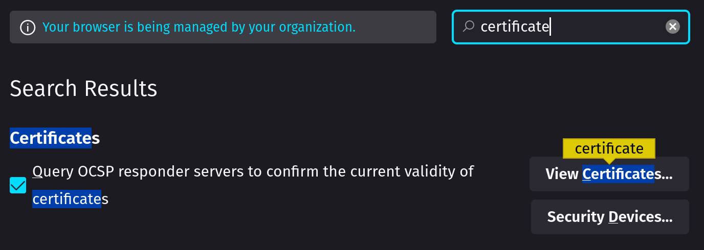
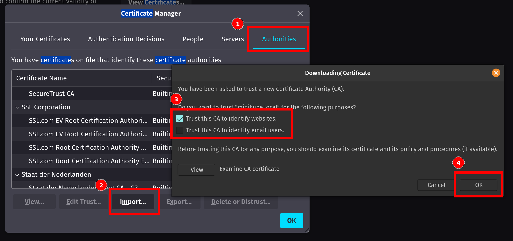
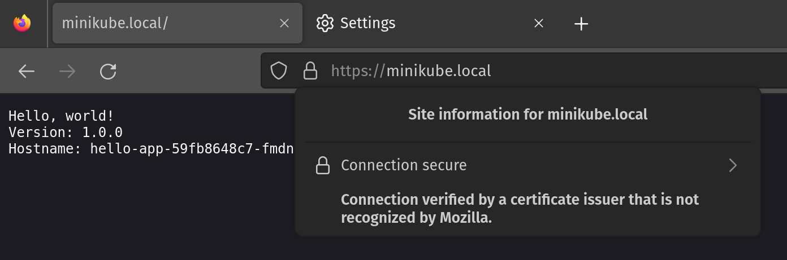
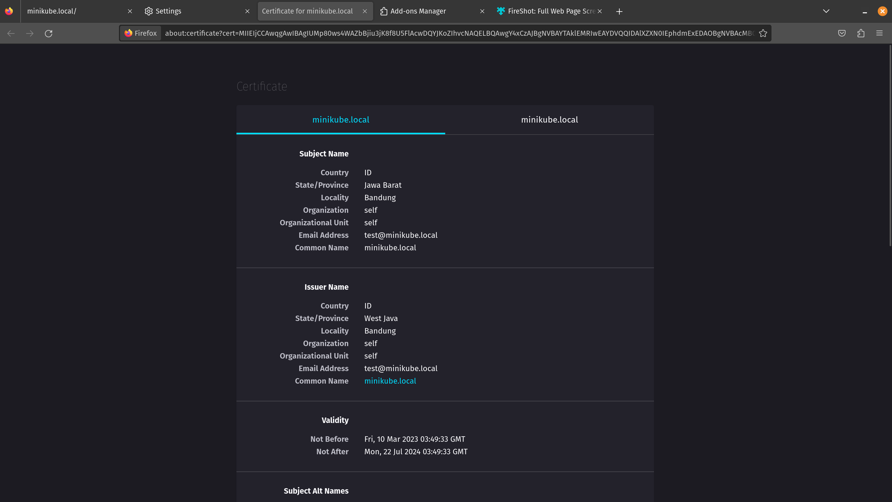

# Simple Kubernetes TLS Ingress

## Prerequisites

- minikube (tested on v1.29.0)
- kubectl (tested on v1.26.2)
- [ingress addon](https://kubernetes.io/docs/tasks/access-application-cluster/ingress-minikube/#enable-the-ingress-controller)
- hosts configured (add 192.168.49.2 as minikube.local in /etc/hosts)
- [ca-certificates](https://packages.ubuntu.com/bionic/ca-certificates)
- web browser (tested on Mozilla Firefox 110.0 64-bit)

## Password

Configure [pass.txt](./pass.txt) to be your desired certificate password.

## Configure Subject Distinguished Name

Open [selfsign.sh](./selfsign.sh) and try to change subject as needed.

```
...-subj "/C=ID/ST=West Java/L=Bandung/O=self/OU=self/emailAddress=test@minikube.local/CN=minikube.local"...
```

```
...
[dn]
C=ID
ST=Jawa Barat
L=Bandung
O=self
OU=self                   
emailAddress=test@minikube.local
CN=minikube.local    
...
```

```
...
[alt_names]
DNS.1 = minikube.local
...
```

## Create self-sign TLS bundle

Simply run self-sign bundle with this command. This command will create a bunch of files. We'll use file called `rootCA.pem` as CA, `server.crt` for certificate, and `server.key` for private key.

```
./selfsign.sh
```

## Deployment

Deploy configuration with this command. This command will create Namespace, Deployment, Service, and Ingress.

```
kubectl apply -f deploy.yaml
```

## Secret

Last but not least, create Kubernetes secret to store `certificate` and `key` we've just created which `server.crt` for certificate and `server.key` for private key.

```
kubectl create secret tls -n tls hello-app-tls --cert server.crt --key server.key
```

## Import Certificate Authority to Browser

Open browser (in this case Mozilla Firefox) setting then search for certificate setting as shown below.



Then you can import our CA which rootCA.pem like as shown below.



## Testing



